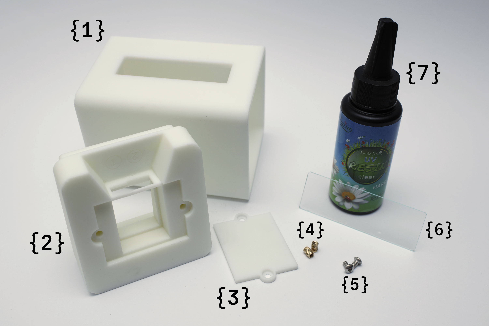
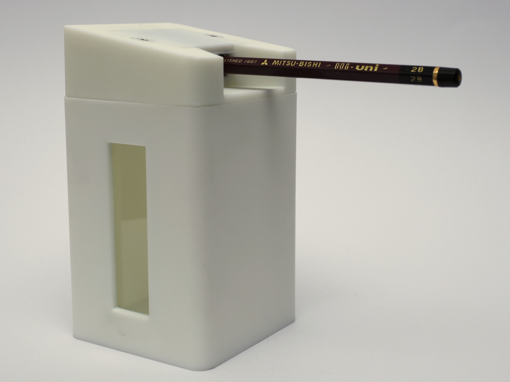

# Container for KUM long point sharpener

 

> This is only for the long point sharpener modules that come with the KUM AS2/AS2 M/AS3. It will not fit the KUM masterpiece, or any other sharpeners from any manufacturer.

 

TLDR: The STL files (mm units) are in the 'STLfiles' folder, and go to section 3 for the things you will need.

## 1 - Introduction
I think the KUM long point sharpeners (or apparently, [long cone sharpener](https://web.archive.org/web/20250126132434/https%3A%2F%2Fkum.net%2Fen%2Flong-cone-sharpener%2F)) are pretty good value for money at ~£4/€5/US$6.
However, there is one aspect that I find a bit irritating; the hinge for the container lid. It is not confidence inspiring, the plastic becomes stressed over time, and the lid breaks off. This is not a very big deal given the price point, but the sharpener module itself is usually still in good condition.
The other minor frustration I have is that the container is too small and needs to be emptied too often.
The lid of my most recent purchase broke off, so I decided it would be a nice project to design a new 3D-printable container while on annual leave from work. This way, the still good sharpener module can be used further, and I can also have a larger container.

### 1.1 - KUM
As an aside, I have always wondered about the name. In doing some research for this, I came across the [product catalogue](https://web.archive.org/web/20241203002716/https://kum.net/wp-content/uploads/2024/09/Katalog_2024_EN.pdf) which describes the history of the company on page 3. It was founded in 1919 by Fritz Mußgüller, and Adam Klebes. So I would hazard a guess that 'KUM' represents _Klebes und Mußgüller_, but I haven't gone to the effort of contacting them for confirmation.

## 2 - Design points
### 2.1 - Sharpener module dimensions
The dimensions of the sharpener itself are approximately 27.7 mm x 34.3 mm x 11.9 mm (WxDxH), looking in the direction of the holes (*hole elevation view*?), and excluding the screw heads.

### 2.2 - Pencil angle
For the final product, I was interested in having the pencil be horizontal when the container was on a surface. That way, you don't have to hold the container in your hand to sharpen easily.

From my rudimentary measurements, the angle of the holes are ~9 °. That is, if you hold the sharpener horizontally (blades up) and insert a pencil, the pencil is angled ~9 ° down.

This is why the lid of the container is at a jaunty angle.

### 2.3 - Window
I thought a window would be a good idea (to inspect fullness).
I did a quick search for custom size cut glass or acrylic, and decided it was not worth the cost.
Consequently, the window is a microscope slide. They are made in uniform/standard sizes, and are available easily. Unfortunately, unless you are a microscopist (or know one), you will probably have to buy a box of excessive quantity. This is still usually less expensive than custom cut glass or acrylic though.

I have gone for the most common size of 25.4 mm x 76.2 mm (1" x 3").

The overall sizing of the container was also impacted by this choice, as I chose semi-arbitrary dimensions to make the proportions look good. Only semi-arbitrary, as a square base was a desired feature, to allow for any lid orientation.

If you are willing to 3D-print the container in a translucent or transparent resin, then I have also included a version of the container without a window cut-out (container_no-window).
Although these are not as clear as glass, it will still be sufficient to see the general fill level.
Alternatively, perhaps a window is not as important for you, and it also saves some BOM cost and effort.

### 2.4 - Blade or module replacement
I wanted to be able to replace the blades easily when they wear out. This meant the module had to be easily accessed, and gluing was excluded.
This is why the top plate is affixed with screws.

### 2.5 - Material of construction
I opted for resin 3D-printing (SLA). This gives a solid final product, *i.e.*, 100 % infill. It is also quite smooth straight off the printer. This is not mandatory, but the weight of the final product is nice, and feels robust. The wall thickness is also fairly high (~5 mm) for these reasons.

I [saw an approach](https://youtu.be/1H4FuNAByUs?t=467) recently where the item was printed hollow, and then filled with plaster. This seems very flexible with fill density, *i.e.*, you could use resin mixed with iron filings for extra mass. Perhaps a bit excessive for this project though.

The current design is not suitable for machining as there are many inaccessible features.

### 2.6 - General comments
I took some rough guesses in the final dimensions to account for tolerances in the 3D-printing. Your 3D-printer, material of choice, etc. may result in a final print that is too small/large for any size-dependent fits.
You may have to do some sanding/cutting/filing for proper fitment.

The STL files are in millimetre units.

## 3 - The meez
*Meez*? - see [page 22](https://search.worldcat.org/title/56630680?oclcNum=56630680). Perhaps more conventionally known as the BOM in this case.

- The three 3D-printed components: container {1}, lid_9deg {2}, and top_plate {3}.
- 2x M3 heat-set threaded inserts {4}, max. 6 mm total length.
- 2x M3 button head screws {5}, max. 6 mm thread length.
- 1x microscope slide, 25.4 mm x 76.2 mm {6}, max. 1.5 mm thickness if you want it flush inside.
- UV curing resin (for fixing the slide in place) {7}.

You will need something to insert the threaded inserts, *e.g.*, soldering iron.
The holes for the threaded inserts are 4 mm. So find an insert with an installation/tip diameter not larger than that.

If you also use M3 button head hex screws, then you will need a 2 mm Allen/Hex key.

You will need a UV light/torch/flashlight to cure the resin. Regular 2-part epoxy resin would also work, but there is some chance of seepage while it cures.
Cyanoacrylate glue could also work, but may haze the glass. I have not tested it, so can't guarantee it will work well.
FDM 3D-prints usually have a rougher surface, so things like RTV silicone, silicone sealant, gasket maker etc. are likely to work. Again, haven't tested it.

## 4 - Assembly
### 4.1 - Insert threaded inserts.

### 4.2 - Insert sharpener module.

### 4.3 - Add top plate.

The disadvantage of using a printing service is if they are using different batches or types of resin etc. then you can end up with a colour mismatch, as I have here. Not a big deal, I may paint the final product at some stage.
I also considered filling the 'step 1' and 'step 2' indicators with enamel hobby paint, but that is also a task for later. Although, we know there is nothing more permanent than a temporary solution.
I like the sheen and colour range of the enamel hobby paint, but a permanent marker would probably also work fine if you want to colour them in.

### 4.4 - Glue in window

### 4.5 -  Et voilà.

## 5 - Conclusions
### 5.1 - Practicality
You shouldn't buy long point sharpeners just to extract the module and use this design.
The purpose is to minimise waste, and prolong the use of the sharpener module after the original product has broken.
I do not have a 3D-printer, and used a service to get the parts made.
Although the service is reasonably priced, I probably could have bought ~8-10 new sharpeners for the all-up cost of this.

### 5.2 - Future designs
- At some point I may modify the design to add a magnetic closure between the container and the top.
- At some point I may make a version to fit the KUM masterpiece.
- At some point I may make a modified design that can be machined.
